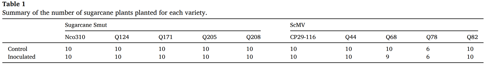
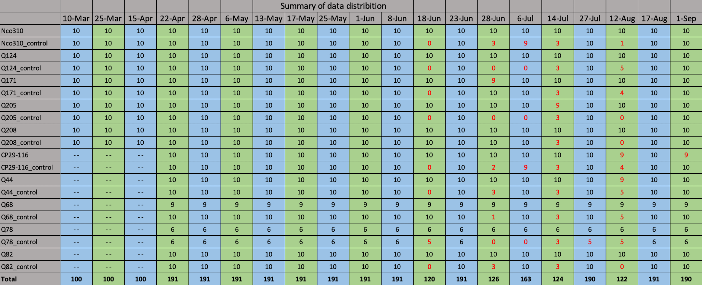
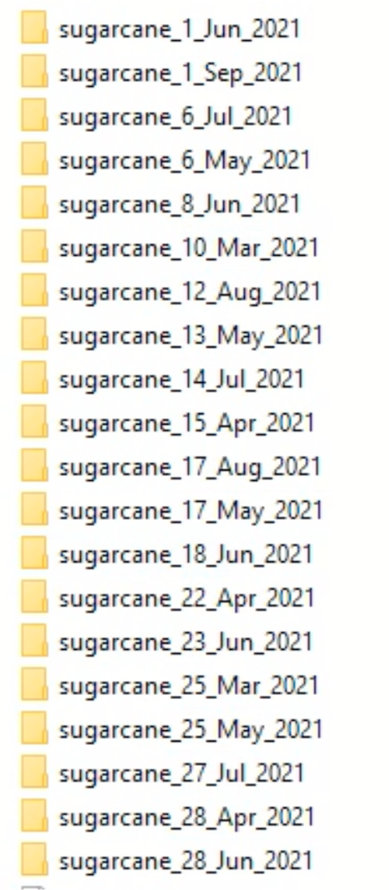

# The Sugarcane-HSI Dataset
[<ins>Jun Zhou</ins>](https://scholar.google.com/citations?user=6hOOxw0AAAAJ&hl=en&oi=ao) [<ins>Dong Bao</ins>](https://scholar.google.com/citations?user=ZRZYhssAAAAJ&hl=en&oi=ao)

<div>
  
</div>

Welcome to the homepage of the Sugarcane-HSI dataset. Sugarcane-HSI contains 3245 
high-resolution hyperspectral sugarcane images. It is established for the early detection 
of sugarcane diseases. 
## Overview
- [Abstract](#abstract)
- [Sugarcane Plant Summary](#sugarcane-plant-summary)
- [Dataset Summary](#dataset-summary)
- [Root Folder Structure](#root-folder-structure)
- [Inspection and Loading of Hyperspectral Images](#Inspection-and-Loading-of-Hyperspectral-Images)
- [Hyperspectral Image Preprocessing](#hyperspectral-image-preprocessing)
- [Removal of Corrupted Bands](#Removal-of-Corrupted-Bands)
- [Download](#Download)
- [Labels](#Labels)
- [Licensing](#Licensing)
- [Acknowledgements](#Acknowledgements)
- [Citation](#Citation)

## Abstract
This is a high-resolution hyperspectral imaging dataset on the early detection of sugarcane diseases which was collected at the 
Pathology Research Station, [Sugar Research Australia](https://sugarresearch.com.au/), Woodford, Queensland in 2021. 
The dataset include two subsets for Sugarcane Mosaic Virus (ScMV) and sugarcane smut diseases respectively.
In total there are 3245 high-resolution hyperspectral images. An [Imec Snapscan VNIR](https://www.imechyperspectral.com/en/cameras/snapscan-vnir) camera was used to capture images. This camera 
can capture visible and near-infrared (VNIR) light from 470 nm to 900 nm wavelengths with 150 spectral bands. A
captured image is a data cube with a size of 1088 × 2048 × 150.

## Sugarcane Plant Summary
<div>
  
</div>
We planted 50 control and 50 inoculated sugarcane plants for sugarcane smut disease study.
We planted 46 control and 45 inoculated sugarcane plants for ScMV disease. There are 5 sugarcane varieties 
used for sugarcane smut disease study and another 5 sugarcane varieties for ScMV disease study. 

## Dataset Summary
<div>
  
</div>
This dataset contains hyperspectral sugarcane images captured over a period of 20 weeks. This table shows image distribution of these 20 subdatasets.
We started to capture sugarcane smut images on Mar 10, 2021. The mosaic images were collected from Apr 22, 2021. So subdatasets collected before Apr 22 
only contains sugarcane smut images. Note that numbers in red indicate that data collection for the corresponding group of sugarcane was not completed 
due to some factors, e.g., wind, rain, and lighting conditions.

## Root Folder Structure
<div>
  
</div>

```bash
├── ...
├── sugarcane_22_Apr_2021   
│   ├── CP29-116  
│      │  *.hdr
│      │  *.raw
│      │  ...
│   ├── CP29-116_c     
│      │  *.hdr
│      │  *.raw
│      │  ...
│   └── Nco310     
│   └── Nco310_c  
│   └── ...
│   └── Q208
│   └── Q208_c
│       dark_ref_irradiance.hdr   
│       dark_ref_irradiance.raw      
└── ...
```
In each subdataset, for example "sugarcane_22_Apr_2021", it contains 20 folders. 
There are two folders for each variety, for example, Nco310 and Nco310_c. Nco310 
contains images of inoculated sugarcane plant, while Nco310_c contains images of 
healthy(control) sugarcane plants. There is a dark reference in each subdataset folder.

## Inspection and Loading of Hyperspectral Images
To inspect images in this dataset, [Scyven](https://scyllarus.data61.csiro.au/software/scyven/) can be used.
Once it is installed, just open any hyperspectral image by clicking on the corresponding ".hdr" file. 
In this hyperspectral format (ENVI), each hyperspectral image has two files, ".hdr" and ".raw". The former one records 
only image meta information, actual image information are stored in the ".raw" file. For loading a hyperspectral image 
in Python, [Spectral Python (SPy)](https://www.spectralpython.net/) module can be used. Specifically, use envi.open() 
function to open ".hdr" file, then the image can be converted to numpy array easily.

## Hyperspectral Image Preprocessing
Images in this dataset are not calibrated or preprocess, they
are original images, so users should decide how to preprocess these images. 
However, the preprocessing algorithm used in our research is provided in this 
repo for users with interests. The detailed instruction can be fond in [README2.md](https://github.com/dbaofd/Sugarcane-HSI/blob/main/README2.md)

## Removal of Corrupted Bands
The Imec Snapscan VNIR camera can capture images with 161 bands with only 150 bands are
useful, 11 bands are corrupted due to technical limitations. Images in this dataset have
161 bands. When doing research with this dataset, the 11 corrupted bands should be removed 
in code. The indices of these 11 corrupted bands are [0,1,2,45,46,47,48,49,50,159,160]. 
When loading one such image in Python using SPy, it can be converted to numpy array easily. 
Afterwards, use slice operation to remove corrupted bands. 
## Download
This dataset has been released for open access on [research repository](https://doi.org/10.25904/1912/4757).
Fill the form in this website and submit the request for dataset download. Note that 
this dataset is around 3.5 TB in total, option available for only download one subdataset.

## Labels
Sugarcane-HSI only contains two image-level labels: infected and control. Since there are
two subsets for the study of two different sugarcane diseases. For each subset, images in 
control folders (e.g., Q124_c, Q68_c) are assigned "control" label, images in inoculated 
folders (e.g., Q124, Q68) are assigned "infected" label. 

## Licensing
© Griffith University. This dataset is licensed under a Creative Commons Attribution license ([CC BY 4.0](https://creativecommons.org/licenses/by/4.0/))

## Acknowledgements
This dataset is a collaboration between [Griffith University](https://www.griffith.edu.au/) 
and [Sugar Research Australia](https://sugarresearch.com.au/), it was supported by the 
Sugar Research Australia Research Grant under a project 
titled “Early detection of sugarcane diseases via hyperspectral imaging and deep learning”. 
Special thanks to [Harpartap Singh](https://au.linkedin.com/in/harpartap-singh-a08b691a9), [Owen Xing](https://scholar.google.com/citations?user=K3KwrPQAAAAJ&hl=en&oi=sra), and Dr [Xiaohan Yu](https://scholar.google.com/citations?user=3PURN9QAAAAJ&hl=en&oi=ao) for helping with the data collection. 

## Citation
If you want to use this dataset in your research, please consider starring or citing, cheers.
```
@article{bao2024early,
  title={Early detection of sugarcane smut and mosaic diseases via hyperspectral imaging and spectral-spatial attention deep neural networks},
  author={Bao, Dong and Zhou, Jun and Bhuiyan, Shamsul Arafin and Adhikari, Prakash and Tuxworth, Gervase and Ford, Rebecca and Gao, Yongsheng},
  journal={Journal of Agriculture and Food Research},
  volume={18},
  pages={101369},
  year={2024},
  publisher={Elsevier}
}
```
