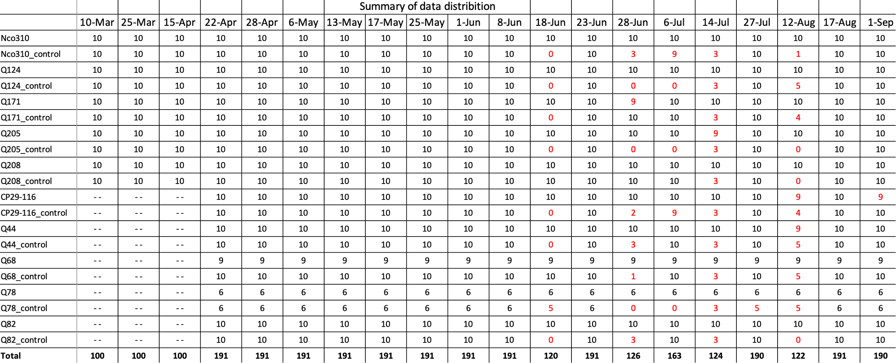

# The Sugarcane-HSI Dataset
[<ins>Jun Zhou</ins>](https://scholar.google.com/citations?user=6hOOxw0AAAAJ&hl=en&oi=ao) [<ins>Dong Bao</ins>](https://scholar.google.com/citations?user=ZRZYhssAAAAJ&hl=en&oi=ao)

Welcome to the homepage of the Sugarcane-HSI dataset. Sugarcane-HSI contains 3245 
high-resolution hyperspectral sugarcane images. It is established for the early detection 
of sugarcane diseases. 
## Overview
- [Abstract](#abstract)
- [Sugarcane Plants Summary](#sugarcane-plants-summary)
- [Dataset Summary](#dataset-summary)
- [Root Folder Structure](#root-folder-structure)
- [Image Preprocessing](#image-preprocessing)
- [Download](#Download)
- [Labels](#Labels)
- [Acknowledgements](#Acknowledgements)
- [Citation](#Citation)

## Abstract
This is a high-resolution hyperspectral imaging dataset on the early detection of sugarcane diseases which was collected at the 
Pathology Research Station, [Sugar Research Australia](https://sugarresearch.com.au/), Woodford, Queensland in 2021. 
The dataset include two subsets for Sugarcane Mosaic Virus (ScMV) and sugarcane smut diseases respectively.
In total there are 3245 high-resolution hyperspectral images. 

## Sugarcane Plants Summary
<div>
  
</div>
We planted 50 control and 50 inoculated sugarcane plants for sugarcane smut disease study.
We planted 46 control and 45 inoculated sugarcane plants for ScMV disease. There are 5 sugarcane varieties 
used for sugarcane smut disease study and another 5 sugarcane varieties for ScMV disease study. 

## Dataset Summary
<div>
  
</div>
This dataset contains hyperspectral sugarcane images captured over a period of 20 weeks. This table shows image distribution of these 20 sub-datasets.
We started to capture sugarcane smut images on Mar 10, 2021. The mosaic images were collected from Apr 22, 2021. So subdatasets collected before Apr 22 
only contains sugarcane smut images. Note that numbers in red indicate that data collection for the corresponding group of sugarcane was not completed 
due to some factors, e.g., wind, rain, and lighting conditions.

## Root Folder Structure
<div>
  
</div>

```bash
├── ...
├── sugarcane_22_Apr_2021   
│   ├── CP29-116  
│      │  *.hdr
│      │  *.raw
│      │  ...
│   ├── CP29-116_c     
│      │  *.hdr
│      │  *.raw
│      │  ...
│   └── Nco310     
│   └── Nco310_c  
│   └── ...
│   └── Q208
│   └── Q208_c
│       dark_ref_irradiance.hdr   
│       dark_ref_irradiance.raw      
└── ...
```
In each subdataset, for example "sugarcane_22_Apr_2021", it contains 20 folders. 
There are two folders for each variety, for example, Nco310 and Nco310_c. Nco310 
contains images of inoculated sugarcane plant, while Nco310_c contains images of 
healthy(control) sugarcane plants. There is a dark reference in each subdataset folder.

## Image Preprocessing
Images in this dataset are not calibrated or preprocess, they
are original images, so users should decide how to preprocess these images. 
However, the preprocessing algorithm used in our research is provided in this 
repo for users with interests. The detailed instruction can be fond in [preprocessing_algorithm.md](https://github.com/dbaofd/Sugarcane-HSI/main/preprocessing_algorithm.md)


## Download
This dataset has been released for open access on [research repository](https://doi.org/10.25904/1912/4757).
Fill the form in this website and submit the request for dataset download. Note that 
this dataset is around 3.5 TB in total, option available for only download one subdataset.

## Labels
Sugarcane-HSI only contains two image-level labels: infected and control. Since there are
two subsets for the study of two different sugarcane diseases. For each subset, images in 
control folders (e.g., Q124_c, Q68_c) are assigned "control" label, images in inoculated 
folders (e.g., Q124, Q68) are assigned "infected" label. 

## Licensing
© Griffith University. This dataset is licensed under a Creative Commons Attribution license ([CC BY 4.0](https://creativecommons.org/licenses/by/4.0/))

## Acknowledgements
This dataset is a collaboration between [Griffith University](https://www.griffith.edu.au/) 
and [Sugar Research Australia](https://sugarresearch.com.au/), it was supported by the 
Sugar Research Australia Research Grant under a project 
titled “Early detection of sugarcane diseases via hyperspectral imaging and deep learning”. 

## Citation
If you want to use this dataset in your research, please consider starring or citing, cheers.
```
@article{bao2024early,
  title={Early detection of sugarcane smut and mosaic diseases via hyperspectral imaging and spectral-spatial attention deep neural networks},
  author={Bao, Dong and Zhou, Jun and Bhuiyan, Shamsul Arafin and Adhikari, Prakash and Tuxworth, Gervase and Ford, Rebecca and Gao, Yongsheng},
  journal={Journal of Agriculture and Food Research},
  volume={18},
  pages={101369},
  year={2024},
  publisher={Elsevier}
}
```
