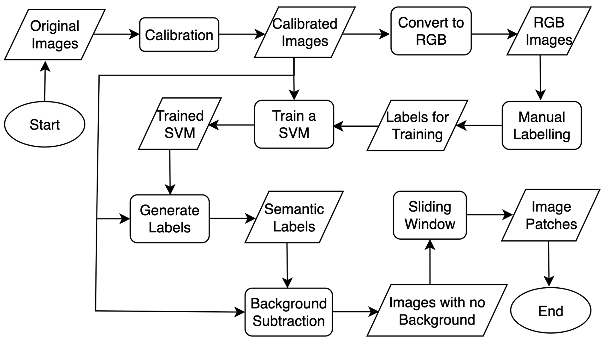
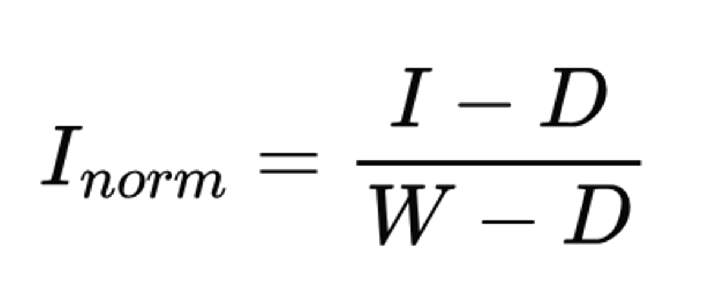
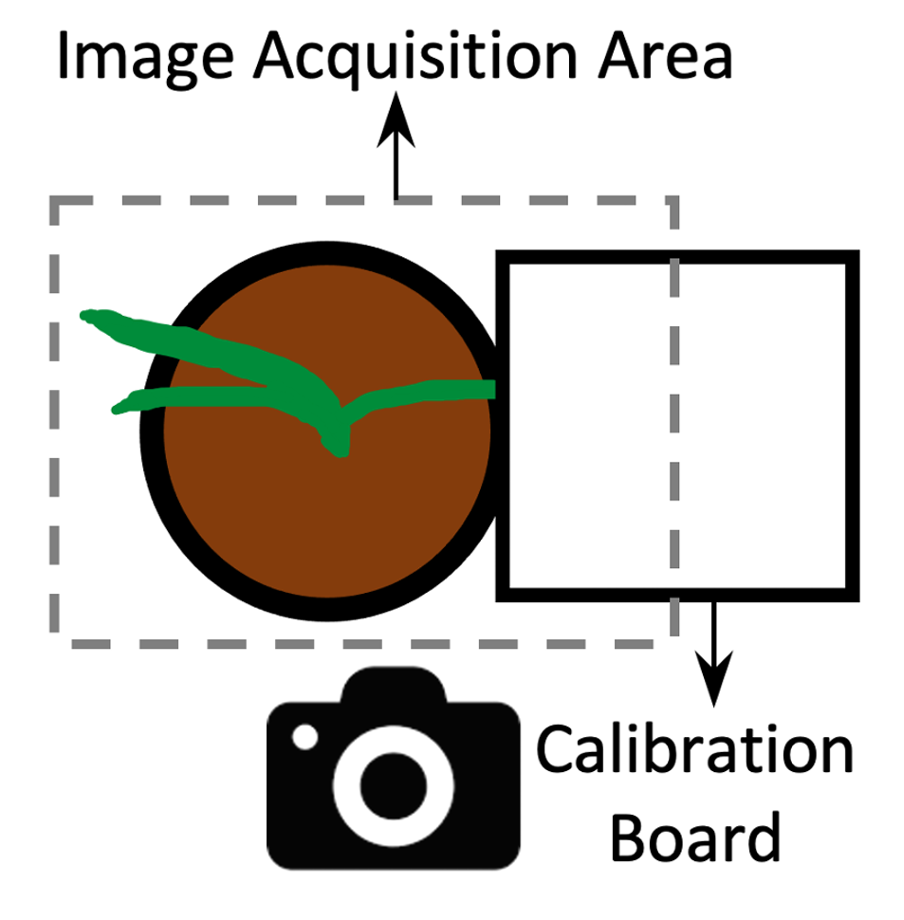
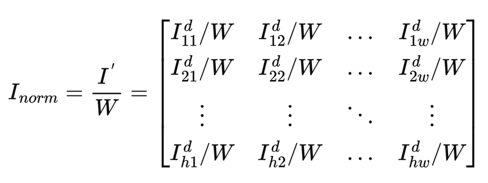
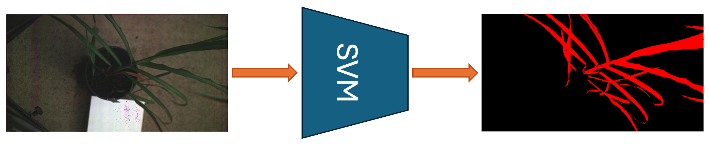
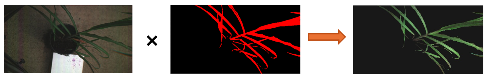
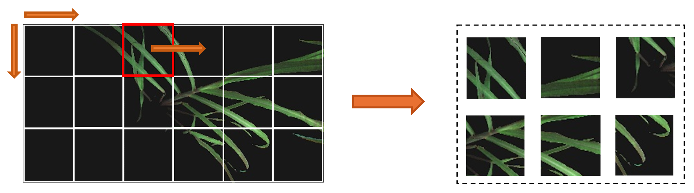
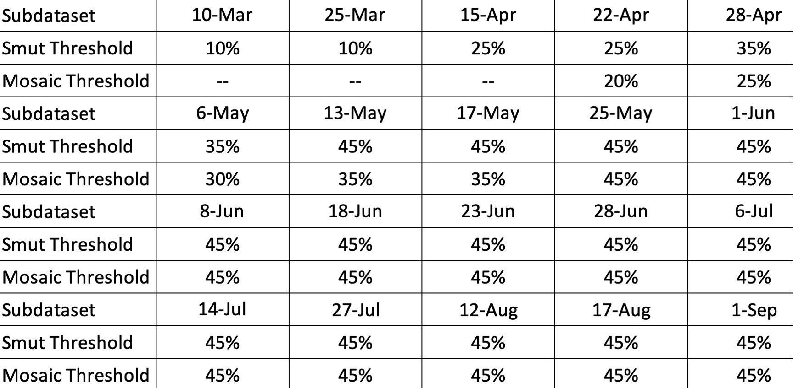

# Hyperspectral Image Preprocessing
<div align="center">
  
</div>
The purpose of hyperspectral image (HSI) processing is to prepare the data for research. 
Specifically, in our case we use the dataset for the deep learning model training. Note that 
our research requires image patches and background removal. Normal hyperspectral image 
preprocessing may only include calibration of the images. Or maybe some researches require
background removal as well. You may refer to our algorithm, and adapt it to make it more suitable
for your research. E.g., you may use our algorithm for calibration only, or background removal.

This documentation will illustrate the preprocessing algorithm we designed for our research. 
The overall flowchart of the algorithm is shown in the above chart which highlights 
7 major steps. Note that further details of preprocessing can be 
found in the paper that is listed in the "Citation" section.
## Overview
- [1. Calibration of Hyperspectral Images](#1-Calibration-of-Hyperspectral-Images)
  - [1.1 Method for Scenario One](#11-Method-for-Scenario-One)
  - [1.2 Method for Scenario Two](#12-Method-for-Scenario-Two)
  - [1.3 Code to Refer to](#13-Code-to-Refer-to)
- [2. Convert HSI to RGB](#2-Convert-HSI-to-RGB)
  - [2.1 Code to Refer to](#21-Code-to-Refer-to)
- [3. Manual Annotation](#3-Manual-Annotation)
  - [3.1 Code to Refer to](#31-Code-to-Refer-to)
- [4. SVM Training](#4-SVM-Training)
  - [4.1 Code to Refer to](#41-Code-to-Refer-to)
- [5. Sugarcane Segmentation](#5-Sugarcane-Segmentation)
  - [5.1 Code to Refer to](#51-Code-to-Refer-to)
- [6. Background Subtraction](#6-Background-Subtraction)
  - [6.1 Code to Refer to](#61-Code-to-Refer-to)
- [7. Image Patch Generation](#7-Image-Patch-Generation)
  - [7.1 Method](#71-Method)
  - [7.2 Predefined Thresholds](#72-Predefined-Thresholds)
  - [7.3 Code to Refer to](#73-Code-to-Refer-to)
- [8. Citation](#8-Citation)
## 1. Calibration of Hyperspectral Images
HSI calibration consists of a dark calibration and white calibration. The dark calibration
can remove the system noise of the camera, while the white calibration can remove the influence
of different lighting conditions. However, there are two different scenarios require different 
calibration methods. 

### 1.1 Method for Scenario One
<strong>Scenario one</strong>: in an indoor environment where lighting condition can be fixed. In this case dark 
reference should be captured first by using the lid to cover the lens. Subsequently, remove the lid
and capture white reference using a calibration board, make sure every pixel in the white reference
image belongs to the calibration board. Then start to collect hyperspectral images.

<strong>Method</strong>: we have hyperspectral image $I \in R^{h \times w \times c}$, dark reference 
$D \in R^{h \times w \times c}$ and white reference $W \in R^{h \times w \times c}$. c is the band number,
h is the height of the image amd w is the width. The calibrated image can be described as:

<div align="center">
  
</div>

[//]: # ($$I_{norm}=\frac{I-D}{W-D}$$)

where subtraction and division are all elementwise operations. 

### 1.2 Method for Scenario Two
<div align="center">
  
</div>
<strong>Scenario two</strong>: in an outdoor environment where lighting condition cannot be controlled. 
In this case, dark reference should be captured first by using the lid to cover the lens. Then we capture 
object (sugarcane in our case) and white reference together in one image as is shown in the above image.
Since the lighting condition may change at any second, every time when an object is being captured, the white
reference should be captured at the same time, so this white reference can reflect the true lighting condition 
of the moment when the object is being captured. Now the difficult part is how to get the white reference.

<strong>Method</strong>: <strong>note that this repo only contains source code for the calibration method for the scenario two</strong>. 
Given an image $I\in R^{h\times w\times c}$, note that the calibration board is inside as well. Then we perform 
dark calibration $I^{d}=I-D$. Since calibration board is in the image, the camera noise in the calibration 
board (white reference) is removed as well. Then we start to do white calibration. We first use 
k-means to extract the white reference in the image, k is set to 2. Since the image is a hyperspectral image, the
rich spectral information enables k-means to achieve high accuracy of calibration board extraction. Once the calibration board
is extracted from a given image, we apply morphology operation to remove the calibration board pixels on the edge, then we remove 
top 1% brightest pixels. Subsequently, we calculate the mean white reference $W \in R^{c}$ by averaging the top 1000 brightest pixels. 
Eventually the calibrated image can be described as:
<div align="center">
  
</div>

[//]: # ($$I_{norm} = \frac{I^{'}}{W}=)

[//]: # (\begin{bmatrix})

[//]: # (I^{d}_{11}/W&I^{d}_{12}/W& ... &I^{d}_{1w}/W \\)

[//]: # (I^{d}_{21}/W&I^{d}_{22}/W& ... &I^{d}_{2w}/W \\)

[//]: # (\vdots&\vdots&\ddots&\vdots\\)

[//]: # (I^{d}_{h1}/W&I^{d}_{h2}/W& ... &I^{d}_{hw}/W \\)

[//]: # (\end{bmatrix})

[//]: # ($$)
### 1.3 Code to Refer to
[calibration.ipynb](https://github.com/dbaofd/Sugarcane-HSI/blob/main/calibration.ipynb)

[hsi_calibration_utils.py](https://github.com/dbaofd/Sugarcane-HSI/blob/main/hsi_calibration_utils.py)

## 2. Convert HSI to RGB
The purpose of this step is to prepare RGB images, so manual annotations can be done 
on these RGB images.

### 2.1 Code to Refer to
[hsi2rgb.py](https://github.com/dbaofd/Sugarcane-HSI/blob/main/hsi2rgb.py)

## 3. Manual Annotation
We used a tool called [Labelme](https://github.com/labelmeai/labelme) for manual annotation. 
Semantic labels of some images are provided in this repo. Refer to ..
### 3.1 Code to Refer to
[convert_label_to_24bit.py](https://github.com/dbaofd/Sugarcane-HSI/blob/main/convert_label_to_24bit.py)

[execute_labelme_command_in_batch.py](https://github.com/dbaofd/Sugarcane-HSI/blob/main/execute_labelme_command_in_batch.py)

## 4. SVM Training
Once we have the semantic labels, we then can train an SVM model that can be used for 
sugarcane segmentation for the whole dataset. 
### 4.1 Code to Refer to
[train_svm.ipynb](https://github.com/dbaofd/Sugarcane-HSI/blob/main/train_svm.ipynb)


## 5. Sugarcane Segmentation
<div align="center">
  
</div>
When the SVM model is trained, we then use this model to generate semantic labels for the 
images in the whole dataset. Some of the labels generated may not be good, so we need to use
morphology to refine the labels. 

### 5.1 Code to Refer to
[sugarcane_segmentation.ipynb](https://github.com/dbaofd/Sugarcane-HSI/blob/main/sugarcane_segmentation.ipynb)

[label_morphology_refine.py](https://github.com/dbaofd/Sugarcane-HSI/blob/main/label_morphology_refine.py)

## 6. Background Subtraction
<div align="center">
  
</div>
Once semantic label for every image in the dataset is ready, we can start to perform background 
subtraction of every image. Given a hyperspectral image and its semantic label, we perform elementwise
multiplication between them. Since sugarcane pixel label is 1 and background pixel label is 0, the sugarcane
pixels in the image will remain unchanged while background pixels will be changed to 0. The graph above
illutrates the process. 

### 6.1 Code to Refer to
[background_subtraction.py](https://github.com/dbaofd/Sugarcane-HSI/blob/main/background_subtraction.py)

## 7. Image Patch Generation
<div align="center">
  
</div>
One whole HSI image in our case is around 1GB in size, and sugarcane pixels occupy around 30% in a whole image. 
If we use the whole image for model training we will have two problems. First, we may not be able to start the 
training process due to the extreme large image. Second, large computational redundancy caused by large percent
of background pixels. Hence, to facilitate the effective and efficient deep learning model training, we then
decide to crop whole images into multiple patches. 

### 7.1 Method
We first obtain the top-left corner coordinated of all the image patches in an image. Then we take advantage of 
semantic labels to select qualified image patches. To determine if an image patch is qualified, we check the percentage
of sugarcane pixels in this patch by using semantic label, if the percentage is beyond a predefined threshold, we 
consider this image patch a qualified one. Then for every image in a subdataset, we obtain a list the top-left corner
coordinates of the qualified image patches, then we save them in a txt file. Then we load txt file, and then save image 
patches based on the coordinates. 

### 7.2 Predefined Thresholds
<div align="center">
  
</div>
This table summarizes the predefined thresholds for all the subdatasets. The reason that these 
threshold varies is that sugarcane in the beginning they are very small, so not many image patches
will have maybe more than 10% sugarcane pixels. To still generate enough image patches, we low down the thresholds.

### 7.3 Code to Refer to
[image_patch_coordinate_generation_using_sliding_window.ipynb](https://github.com/dbaofd/Sugarcane-HSI/blob/main/image_patch_coordinate_generation_using_sliding_window.ipynb)

[generate_small_patches.py](https://github.com/dbaofd/Sugarcane-HSI/blob/main/generate_small_patches.py)
## 8. Citation
If you want to use this preprocessing algorithm in your research, please consider starring or citing, cheers.
```
@article{bao2024early,
  title={Early detection of sugarcane smut and mosaic diseases via hyperspectral imaging and spectral-spatial attention deep neural networks},
  author={Bao, Dong and Zhou, Jun and Bhuiyan, Shamsul Arafin and Adhikari, Prakash and Tuxworth, Gervase and Ford, Rebecca and Gao, Yongsheng},
  journal={Journal of Agriculture and Food Research},
  volume={18},
  pages={101369},
  year={2024},
  publisher={Elsevier}
}
```