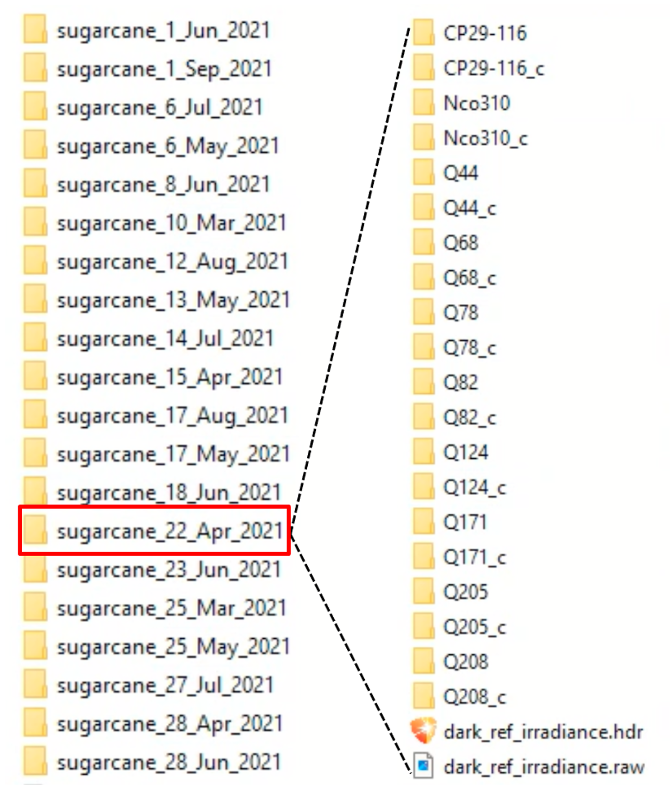

# Hyperspectral Image Datasets for Sugarcane Disease
## Abstract
This is a hyperspectral imaging dataset on sugarcane disease detection which was collected at the 
Pathology Research Station, Sugar Research Australia (SRA), Woodford, Queensland in 2021. The dataset include two subsets for Sugarcane Mosaic Virus (ScMV) and sugarcane smut diseases respectively.
This dataset is a collaboration between [Griffith University](https://www.griffith.edu.au/) and [SRA](https://sugarresearch.com.au/),
and has been released for open access at Griffith University [research repository](https://doi.org/10.25904/1912/4757).

## Sugarcane Plants Preparation

  

We planted 50 control and 50 inoculated sugarcane plants for sugarcane smut disease study.
We planted 46 control and 45 inoculated sugarcane plants for ScMV disease.

## Dataset Summary

  

This dataset contains hyperspectral sugarcane images captured over a period of 20 weeks. This table shows image distribution of these 20 sub-datasets.
We started to capture sugarcane smut images on Mar 10, 2021. The mosaic images were collected from Apr 22, 2021. So sub-datasets collected before Apr 22 
only contains sugarcane smut images. 

  

.
├── ...
├── test                    # Test files (alternatively `spec` or `tests`)
│   ├── benchmarks          # Load and stress tests
│   ├── integration         # End-to-end, integration tests (alternatively `e2e`)
│   └── unit                # Unit tests
└── ...
In each sub-dataset, for example "sugarcane_22_Apr_2021", it contains 20 folders. As we can see, there are two folders for each variety, for example, Nco310 and Nco310_c. Nco310 contains images of inoculated sugarcane plant, while Nco310_c contains images of healthy(control) sugarcane plants. 

